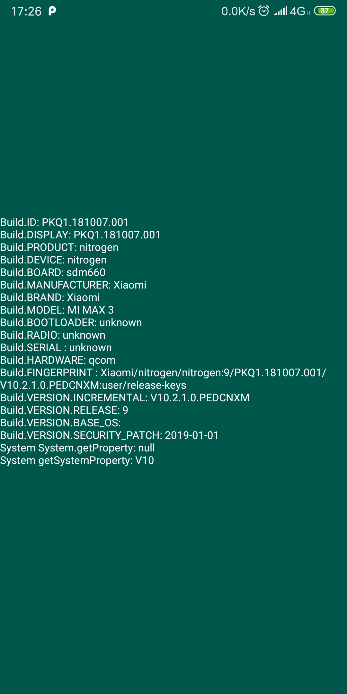

# SystemAptation
国内主流手机厂商操作系统适配（华为、小米、oppo、vivo等等），持续更新...

## 零、版本说明
当前版本只是适配了不分小米和魅族的状态栏字体颜色

## 一、使用说明
1. StatusBarBgUtil这个类直接修改状态栏背景颜色
2. StatusBarUtil直接封装了所有状态栏的操作，是适配后的封装类，可以直接调用

## 二、手机厂商开发者
1. [小米开放平台](https://dev.mi.com/console/doc/)
1. [vivo开发者平台](https://dev.vivo.com.cn/documentCenter)
1. [锤子开发者中心](http://dev.smartisan.com/)
1. [三星开发者中心](https://developer.samsung.com/home.do)
1. [oppo开放平台](hhttps://open.oppomobile.com/)
1. [魅族开放平台](https://open.flyme.cn/)
1. [华为开发者联盟](https://developer.huawei.com/consumer/cn/)


## 二、Build类说明

#### 1、代码
```
 stringBuilder.append("Build.ID: " + Build.ID + "\n");//修订版本列表
        stringBuilder.append("Build.DISPLAY: " + Build.DISPLAY + "\n");//显示屏参数
        stringBuilder.append("Build.PRODUCT: " + Build.PRODUCT + "\n");//整个产品的名称
        stringBuilder.append("Build.DEVICE: " + Build.DEVICE + "\n");//设备参数
        stringBuilder.append("Build.BOARD: " + Build.BOARD + "\n");//主板
        stringBuilder.append("Build.MANUFACTURER: " + Build.MANUFACTURER + "\n");//硬件制造商
        stringBuilder.append("Build.BRAND: " + Build.BRAND + "\n");//系统定制商
        stringBuilder.append("Build.MODEL: " + Build.MODEL + "\n");//版本即最终用户可见的名称
        stringBuilder.append("Build.BOOTLOADER: " + Build.BOOTLOADER + "\n");//系统启动程序版本号
        stringBuilder.append("Build.RADIO: " + Build.RADIO + "\n");
        stringBuilder.append("Build.SERIAL : " + Build.SERIAL + "\n");
        stringBuilder.append("Build.HARDWARE: " + Build.HARDWARE + "\n");// 硬件名称
        stringBuilder.append("Build.FINGERPRINT : " + Build.FINGERPRINT + "\n");
        stringBuilder.append("Build.VERSION.INCREMENTAL: " + Build.VERSION.INCREMENTAL + "\n");
        stringBuilder.append("Build.VERSION.RELEASE: " + Build.VERSION.RELEASE + "\n");
        stringBuilder.append("Build.VERSION.BASE_OS: " + Build.VERSION.BASE_OS + "\n");
        stringBuilder.append("Build.VERSION.SECURITY_PATCH: " + Build.VERSION.SECURITY_PATCH + "\n");
        stringBuilder.append("System System.getProperty: " + System.getProperty("ro.miui.ui.version.name") + "\n");

        new Thread(() -> {
            stringBuilder.append("System getSystemProperty: " + SystemPropertyUtil.getSystemProperty("ro.miui.ui.version.name") + "\n");
            runOnUiThread(() -> ((TextView) findViewById(R.id.text)).setText(stringBuilder.toString()));
        }
        ).start();
```
#### 2、输出结果实例



## 三、注意事项
1. 修改状态栏字体颜色后再调用透明状态栏属性才会使得界面布局延伸到状态栏，例如
```
      mCompositeDisposable.add(StatusBarUtil.setStatusBarDarkTheme(this, false, success -> {
            //需要在完成之后回调才会保证布局可以延伸到状态栏
            StatusBarUtil.translucentStatus(this);
        }));
```
> 由于适配中需要查询是什么操作系统/手机厂商,设置状态栏深色浅色切换的方法直接封装到了Rxjava中，并且方便做线程切换
```

    /**
     * 设置状态栏深色浅色切换
     */
    public static Disposable setStatusBarDarkTheme(@NonNull final Activity activity, boolean dark, SystemCheckCallBack osCheckCallBack) {
        return Observable.just(dark ? 1 : 0).observeOn(Schedulers.computation())
                .subscribeOn(Schedulers.computation())
                .map(integer -> {

                    if (MIUI.isXiaomiDevice()) {
                        //小米不仅要适配 Build.VERSION_CODES.M，还要适配7.7.13版本以上
                        return MIUI.setStatusbarColorUtils(activity, dark);
                    } else if (FLYME.isFlymeDevice()) {
                        return FLYME.setStatusBarColorUtils(activity, dark);
                    } else if (Build.VERSION.SDK_INT >= Build.VERSION_CODES.M) {
                        return setCommonUI(activity, dark);
                    } else {//6.0以下,5.0原生系统无法修改字体颜色,用了个比较取巧的办法,设置成半透明灰色.
                        return StatusBarBgUtil.initStatusBar(activity);
                    }
                })
                .subscribe(aBoolean -> {
                    if (osCheckCallBack != null) {
                        osCheckCallBack.checkFinish(aBoolean);
                    }
                    Log.d(TAG, "accept aBoolean: " + aBoolean);
                }, throwable -> Log.e(TAG, "accept: ", throwable));
    }
```
2. 如果你需要调用这个方法，注意会导致线程阻塞，请不要在UI线程调用
```
    @WorkerThread
    public static String getSystemProperty(String propName) {
        String line;
        BufferedReader input = null;
        try {
            Process p = Runtime.getRuntime().exec("getprop " + propName);
            input = new BufferedReader(new InputStreamReader(p.getInputStream()), 1024);
            line = input.readLine();
            input.close();
        } catch (IOException ex) {
            Log.e(TAG, "Unable to read sysprop " + propName, ex);
            return null;
        } finally {
            if (input != null) {
                try {
                    input.close();
                } catch (IOException e) {
                    Log.e(TAG, "Exception while closing InputStream", e);
                }
            }
        }
        return line;
    }
```
